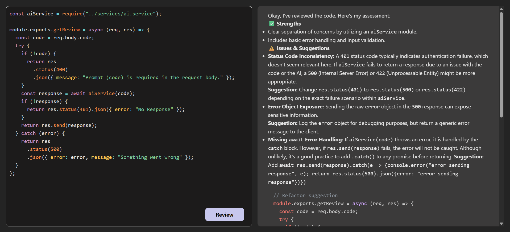

# AI Code Reviewer

An intelligent, full-stack AI-powered application that reviews code snippets in real-time and provides suggestions, optimizations, and best practices. Built with a modern React frontend and a robust Node.js + Express backend, this tool streamlines code quality checks for developers.

---

## Project Screen Shot



---

## Features

- **Smart Code Analysis** – Get AI-generated feedback on your code in seconds.
- **Multi-Language Support** – Review code in JavaScript, Python, C++, Java, and more.
- **Full-Stack Architecture** – Built using React (frontend) and Node.js with Express (backend).
- **Environment-safe** – Secrets and configs are securely managed using environment variables.
- **Extensible Design** – Easy to integrate with IDEs or CI/CD pipelines in the future.

---

## Tech Stack

| Layer         | Technology        |
| ------------- | ----------------- |
| Frontend      | React.js          |
| Backend       | Node.js, Express  |
| AI Service    | Google Gemini API |
| Styling       | CSS               |
| Communication | RESTful API       |

---

## Getting Started

### 1. **Clone the Repository**

```bash
git clone https://github.com/your-username/ai-code-reviewer.git
cd ai-code-reviewer
```

### 2. **Backend**

```bash
cd backend
npm i
```

After that, make sure to create an Environment Variable File(.env) and fill the below content:

```bash
GOOGLE_GEMINI_KEY=<gemini_api_key>
FRONTEND_URI=<frontend_url>
PORT=<port_for_backend>
```

You can generate an API key from: [Gemini API](https://ai.google.dev/)

### 3. **Frontend**

```bash
cd frontend
npm i
```

Also create an Environment Variable File(.env) and fill the below content:

```bash
VITE_BACKEND_URI=<backend_url>
```
